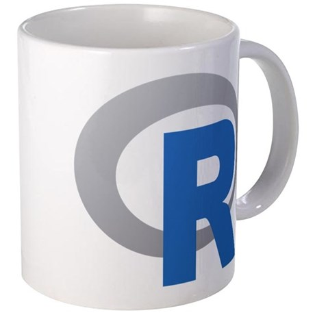

```{r setup, include=FALSE}
knitr::opts_chunk$set(echo = FALSE)
```

## *HMMMM...*

-   Tidal zone development for the Delaware and Schuylkill Rivers

-   Tide and SLR Impact Analysis on Regulator Critical Elevations 

-   Regulator outfall level breakout detection
    
-   Centralized H&H database

<div class="notes">

Hello, everyone, my name is Hao Zhang, and I worked in the H&H modeling group. Today I'm gonna talk about a few data analysis projects that I've been worked on, and I'd like to share a few R packages that you may found useful. 

</div>

## Introduction of R {.build}

<div class="columns-2">

**What's R?**

-  A Data Analysis Tool

<div class="blue2">
    "R is the Excel on Steroids."   
            -- Rajesh Rajan (2017)
</div>

-  A Programming Language

**What's good in R?**

-  vectored operation

-  10000+ open-source packages

    +  community supported

    +  CRAN system


</img>   

</div>

<div class="notes">

At the H&H modeling group, we deal with large amount of data everyday. 
I've been actively using R for 3 years for data analysis, and I'm quite enjoy using it. 
Inherit from the language S, R is a powerful tool for statistics and data visualization. 
I'd like to mention that R is also a fully-wedged programming language just like python and java.

The biggest advantage of R is the vectorized operation, which allows you to apply an operation to a series of data without using a loop. Another advantage is R has a mature user-supported community and over 10 thousands open source packages. 

Okay, let's start with the first project.

</div>

# Tidal zone development for the Delaware and Schuylkill Rivers

##

<div class="columns-2">

**BACKGROUND**

Tide along the Delaware and Schuylkill rivers is shifted up to an hour

**OBJECTIVES**

Categorize the Delaware and Schuylkill rivers in Philadelphia into tidal zones, so that each regulator outfall can have a more representative tide time-series as the boundary condition

**METHODOLOGY**

-   Harmonic analysis for nearby NOAA stations  
-   Interpolation of the M2 constituent

</img>

</div>

<div class="notes">

The delaware river and schulykill river are both tidal, and the phase difference between the downstream and upstream can be as much as 1 hour. 

As an effort to the model update, the philadelphia region of these two river needs to be categorized into tidal zones, so that each regulator outfall can have a more representative tide time-series as the boundary condition. 

To do that, a harmonic analysis was performed on 9 nearby NOAA stations, and the parameters of the primary semi-diurnal constituent is fitted linearly against the river miles. The phase is represented by the time difference relative to the NOAA Philadelphia station, The magnitude is represented by the Local Mean Sea Level at NAVD88, converted by NOAA’s Vdatum software, and the amplitude is the maximum height of wave crest or though. 

</div>

##Results

<div class="columns-2">

</img>

<br>
<br>
<br>
<br>

</img>

</div>

<div class="notes">
As shown, the time difference and local mean sea level both fit well to linear relationships. To better represent the local conditions, the 3 stations within the city boundary were used for interpolation,  including the Philadelphia, the Bridesburg, and the Tacony-Palmyra Bridge. (The Pier 11 station was excluded as its M2 parameters appear to be an outlier.)

Since the amplitude depends on the bathymetry and morphology of the river, the amplitude doesn’t show a good linear fit. Since the amplitude varied by less than 0.2 ft, the amplitude adjustment is not applied as of now.

To balance the complexity and performance of the model, the zonal boundary is set to 15 minutes of phase difference. The centroid of zone 1 is at the NOAA Philadelphia station, and the other zones were determined accordingly by interpolation. The tidal schulykill river is classified as one tidal zone according to the level data monitored at the regulator outfalls, which is 15 minute ahead of zone 1.
</div>

***

<div class="columns-2">
</img>

</img>
<br>
<br>
<br>
<br>

</div>

<div class="notes">
The adjustment coefficients are shown here.
The Delaware River is therefore categorized as 4 tidal zones, each delayed by 15 minutes and offset by 0.06 ft in tide level. As shown, the adjusted time series match closely to the observations at the NOAA tide stations for each tidal zone.
For Schulykill River, the adjustment parameters are extrapolated to the junction of the Schuylkill River and the Delaware River at R.M 92.5, and the adjusted time-series is validated by the observations at the USGS tide station.
</div>
***

<iframe src="SWOs_Validation_new.nb.html" style="border: 0; position:absolute; top:0; left:0; right:0; bottom:0; width:100%; height:100%"></iframe>

<div class="notes">
the adjusted tides are validated against the levels at regulator outfalls for the week of July 22, 2016. 
This plot shows the The water levels on the Tidal Schuylkill River, which do not show a visible phase shift like the Delaware River, This could be related to the Seiche effect caused by the Fairmount Dam, where a standing wave is formed in the partially enclosed body of water. In addition, the rising-tide shows a step-like pattern with regular intervals, which could be related to the hydraulic-wake caused by the bends of the river.

These plots are generated by the dygraphs package, which will be covered in the next few slides.

</div>

##  Environmental Packages
<div class="columns-2">
**`rnoaa` package**: R interface to NOAA climate data

```{r eval=F, echo=T}
library(rnoaa)
tide <- coops_search(
             begin_date = 20161201,
             end_date = 20161231,
             station_name = 8545240,
             product ='water_level',
             datum = 'NAVD',
             units = 'english',
             time_zone = 'lst')[[2]]
```

<br>
<br>
<br>
<br>
<br>

**`TideHarmonics` package**: Implements harmonic analysis of tidal and sea-level data with over 400 harmonic tidal constituents (`T-tide` equivalent in R)
    
```{r eval=F, echo=T}
library(TideHarmonics)
hfit <- ftide(tide$v, tide$t, hc7)

```

    Harmonics:
        amplitude  phase      sine      cosine   
    M2  2.57826    58.60719   2.20085   1.34302
    K2  0.56254   207.66470  -0.26118  -0.49823
    N2  0.49710    33.30092   0.27293   0.41548
    K1  0.44734    52.71923   0.35594   0.27096
    P1  0.27295   313.78100  -0.19706   0.18885
    S2  0.24909   189.67717  -0.04187  -0.24554
    O1  0.17018    21.34632   0.06195   0.15851

</div>

<div class="notes">

The rnoaa package provides a R interface to the NOAA data set, which is useful for downloading meteorlogical and climatical data, such as tide data.  This example shows how to download tide data at the philadelphia station.

The TideHarmonics package is the T-tide equivalent in R, which can do harmonic analysis with over 400 constituents. This example shows how to get the 7 principle constituents from the tide data. 

</div>

## Time-series handling

<div class="columns-2">
**`zoo` package**: Z's Ordered Observations

-   classes `zoo`, `zooreg`   
-   for both **irregular** and regular time-series

```{r echo=T, eval=F}
zoo(x, order.by, frequency, calendar)
```
    
-  `na.*()` : impute time-series by various methods. [example](imputeTS_methods_comparison_B.html)
-  `roll*()`: apply rolling functions

```{r echo=T, eval=F}
rollmean(nottem,2)
rollapply(nottem, 2, mean, by=3) 
```

<br>

**`xts` package**: extended zoo/ts

-  robust subsetting: 
    
```{r eval=F, echo=T}
   # subsets data within time range
   xts["T06:00/T18:00"]
   # subsets data within date range
   xts["2012-01-01/2012-03-21"]
   # subsets data by start/end date
   xts["/2011"], xts["2011/"]
   # subsets by 'IS NOT' condition
   xts[-xts[daterange, which.i=T],] 
```

-  required by the `dygraphs` package
<br>
<br>
<br>
<br>

</div>

<div class="notes">
For time handling, the zoo package and xts package both provide an object for time-series. In addition, the na family functions are capable of filling irregular time steps with various algorithms. This example demostrates the difference between the imputation algorithms. Besides, The roll family functions are handy for calculating moving averages and etc.

The xts comes with an elegant subsetting method, for example, to subset the data from 6am to 6pm , simply use slash between the start and end time. This can be handy for calculating the nightly minumum flow. 
</div>

***
<div class="columns-2">
**`lubridate` package**: Dates and times made easy

-  `parse_date_time(), fast_strptime(), ymd_hms()`: parse character vector to POSIXct

**Reminder**: different than `as.POSIXct()` or `strptime()`,  the time zone is set to UTC by default
        
-  `rollback()`: roll back date to last day of previous month, or the first day of this month 
    
-  `with_tz(), force_tz()`: time zone adjustment

<br>

**`dygraphs` package**:  interactive time-series plots 

-  based on the `dygraphs` JavaScript charting library

```{r echo=T, eval=F}
dygraphs(data, 
         main = NULL, 
         xlab = NULL, ylab = NULL, 
         periodicity = NULL, 
         group = NULL, 
         elementId = NULL, 
         width = NULL, height = NULL)
```


-  data must be `xts` class or equivalent
-  use `mts` object for multi- time-series
-  returns a HTML widget
</div>

<div class="notes">

The lubridate package is useful for handling date and time. It comes with 3 parse functions, the parse_date_time() can guess the format by a few combination, and therefore is good for mixed format or unknown format. The fast_strptime() can only handle numeric format and it's faster than the base strptime() function; the ymd_hms() is flexible on the format as long as the order is correct. The only thing I find annoying is that these parsers set timezone to UTC by default, therefore, you need to specify the time zone in the function.

The rollback() function is useful to round the datetime to the nearest even time stamp. The with_tz() and force_tz() functions are useful for adjusting the Daylight Savings Time and time zones.

The dygraphs package generates nice looking time-series plots with tooltips with simple syntax. The function takes an xts object and output an HTML widget, which can be easily emeded into an interactive document such as Rmarkdown or Rnotebook. 
</div>

# Tide and SLR Impact Analysis on CSO Regulators

## 
**OBJECTIVES**

Evaluate the impact of tide levels on Philadelphia's Combined Sewer system:

-   demostrate the hydraulic critical elevations of regulators in an interceptor system

-   generate the CDFs of hydraulic critical elevations for selected interceptor systems

**IMPLEMENTATION**

-   developed in R's shiny framework

-   plots made in ggplot2, with some hacks to show tool-tips

-   deployed on a shiny server, hosted by Amazon Web Service (AWS)

<div class="notes">
As an effort of model updates, the H&H modeling group had conducted a field survey for Philadelphia's regulators in 2015 to confirm or update the regulators' critical elevations, such as weir crest elevation and overflow invert elevation. The result was presented as a web application that demostrates the actual elevation of the critical elevations, and generates the cumulative density function plots by interceptor. The app is developed in R's shiny framework, with the plot made in ggplot2. To overlay tooltips on the plots, some hacks was done on the app-level. The app is then deployed on a shiny server, hosted by the Amazon Web Service. 
</div>

## {.smaller}
<http://52.90.33.211/DamElevCDF/>

<iframe src="http://52.90.33.211/DamElevCDF/" style="border: 0; position:absolute; top:1; left:0; right:0; bottom:0; width:100%; height:84%"></iframe>

<div class="notes">

The app is showing here. Users can specify the interceptors to be included in the CDF, and changes the scales of the axes. The plots comes with 4 annotations such as the MHHW and MLLW at 2085, and users can add more annotations as needed. The tooltip shows the value of the data when hovered over. 

This plot shows the same data in the form of box-whiser plot. 

This plot shows the actual elevations by interceptor, and it also shows if a tide gate or flap gate has been installed. The regulator is sorted by the distance to the downstream WPCP, and it can also be plotted using the actual distance. 

This table summaries the stats by interceptor.

</div>

## Data Visualization Packages 

<div class="columns-2"> 

**`shiny` package**: a simple web apps development framework in R

**shiny apps**

-   deployable on local machine, remote server, and cloud
-   UI.R + server.R + global.R

**shiny server**
    
-  host shiny apps (Linux only for now)
-  accessible from any browser

**Reactivity**


```{r eval=F, echo=T}
server <- function(input, output) {
  output$distPlot <- renderPlot({
    hist(rnorm(input$obs), 
         col = 'darkgray', border = 'white')
  })
}
ui <- fluidPage(
  sidebarLayout(
    sidebarPanel(
      sliderInput(
          "obs", "Number of observations:", 
          min = 10, max = 500, value = 100)
    ),
    mainPanel(plotOutput("distPlot"))
  )
)
shinyApp(ui = ui, server = server)
```

</div>


<div class="notes">

A shiny app normally comes with 2 parts. the 'server' handles the backend computation and event-triggering, and the 'UI' provides an interface for input and output, optionally, there is a 'global' module that contains non-reactive functions and constants, etc. 

The app can be deployed on local machine, remote server such as AWS with shiny server, and cloud-services, such as shinyapps.io.

</div>

## {.smaller}

**`ggplot2` package**: creating graphics based on 'The Grammar of Graphics'

<div class="columns-2"> 
```{r eval=F, echo=T}
library(ggplot2)
d<- diamonds[sample(nrow(diamonds), 1000),]

ggplot(d)+ 
    geom_point(aes(x=carat, y=price, 
                   color=carat,size=carat))+
    theme_classic()
```
<br>

```{r eval=T, echo=F, fig.height=2, fig.width=4}
library(ggplot2)
d<- diamonds[sample(nrow(diamonds), 1000),]

ggplot(d)+ 
    geom_point(aes(x=carat, y=price, 
                   color=carat,size=carat))+
    scale_size_continuous(range=c(1,3))+
    theme_classic()
```
</div>

**`ggedit` package**: a shiny widget for setting ggplot themes and layer aesthetics 

-   `ggedit(p)`: bring up the editor GUI for the ggplot object
-   `rgg()`: replace a layer from the ggplot object

**`grid`, `gridExtra` packages**: useful to combine ggplots

```{r echo=T, eval=F}
gA <- ggplotGrob(ZN0.valid)
gB <- ggplotGrob(ZN1.valid)
gB$widths <- gA$widths
grid.newpage()
g <- grid.arrange(gA,gB, ncol=1, heights=unit(rep(1.5,2),'in'), widths=unit(5,'in'))
```

<div class="notes">

ggplot is probably the most popular charting tool in R. It generates plots in various formats using a consistent syntax that adopted from the Grammar of Graphics.  The ggedit package is a shiny widget that let you set the layouts in GUI. It's useful for setting complicated layout of a ggplot. Also, the grid() and gridExtra() packages are useful for making collage plots.  

</div>

***
**`plotly` package**: 

-  D3.js html widgets, easy to embed in documents 
-  includes various types of charts  <https://plot.ly/r/>  
-  `ggplotly()`: wrapper for ggplot   

<div class="columns-2"> 

```{r echo=T, eval=F}
library(plotly)
set.seed(100)
d <- diamonds[sample(nrow(diamonds), 1000),]

p <- plot_ly(d, 
             x = ~carat, 
             y = ~price, 
             color = ~carat,
             size = ~carat, 
             text = ~paste("Clarity: ", 
                           clarity))
```

<br>

```{r, message = FALSE, echo=F, include=F, eval=F}
library(plotly)
set.seed(100)
d <- diamonds[sample(nrow(diamonds), 1000),]

p <- plot_ly(d, 
             x = ~carat, 
             y = ~price, 
             color = ~carat,
             size = ~carat, 
             text = ~paste("Clarity: ", 
                           clarity),
             width = 450,
             height = 300)

htmlwidgets::saveWidget(p, file="plotly.html")
```
<iframe src='plotly.html' height=300 weight=450></iframe>


</div>

<div class="notes">
The plotly package generates interactive plots that can be zoomed, paned, and picked. This example shows the sample code and looks of the plot. 

Another advantage of plotly is that it has a ggplot wrapper that will convert your ggplot to a plotly object. 

</div>

##

**`ggvis` package**: create interactive graphics with a syntax similar to ggplot2

-  leverage shiny's infrastructure, e.g., sliders, buttons

-  still under development (v0.4 now), may experiencing dramatic syntax change

<http://ggvis.rstudio.com/>

**`googleVis` package**

-  developed by Google, primarily for BI purposes

-  has many types of charts, maps, and tables

<https://developers.google.com/chart/interactive/docs/gallery>


## `ggvis` package {.smaller}

Create interactive graphics with a syntax similar to ggplot2

-  leverage shiny's infrastructure, e.g., sliders, buttons

-  still under development (v0.4 now), may experiencing dramatic syntax change

<http://ggvis.rstudio.com/>

<div class="columns-2">
```{r, echo=TRUE, eval=F}
library(ggvis)
mtcars %>%
    ggvis(x = ~wt, y = ~mpg) %>%
    layer_smooths(se=TRUE, 
                  opacity := 0.5, 
                  opacity.hover := 0.75) %>% 
    layer_points(fill = ~factor(cyl), 
                 size := 50, 
                 size.hover := 200) %>%
    set_options(hover_duration = 250,
                height = 300, 
                width = 500)
```

```{r, echo=F,eval=T, message=FALSE, warning=FALSE, height=4, widths=5}
library(knitr)
library(ggvis)
mtcars %>%
    ggvis(x = ~wt, y = ~mpg) %>%
    layer_smooths(se=TRUE, 
                  opacity := 0.5, 
                  opacity.hover := 0.75) %>% 
    layer_points(fill = ~factor(cyl), 
                 size := 50, 
                 size.hover := 200) %>%
    set_options(hover_duration = 250,
                height = 300, 
                width = 500)
```
</div>

## `googleVis` package {.smaller}

developed by Google, primarily for BI purposes

-  includes many intersting types of charts, maps, and tables

<https://developers.google.com/chart/interactive/docs/gallery>

<div class="columns-2">
```{r echo=T, eval=F}
op <- options(gvis.plot.tag = 'chart')

Anno <- gvisAnnotationChart(
            Stock, 
            datevar="Date",
            numvar="Value", 
            idvar="Device",
            titlevar="Title", 
            annotationvar="Annotation",
            options=list(
              width=800, height=350,
              fill=10, displayExactValues=TRUE,
              colors="['#0000ff','#00ff00']")
)
plot(Anno)
```
<br>
<br>

```{r echo=F, eval=T, warning=FALSE, message=FALSE, results='asis', tidy=FALSE}
library(googleVis)

op <- options(gvis.plot.tag = 'chart')
Anno <- gvisAnnotationChart(Stock, 
            datevar="Date",
            numvar="Value", 
            idvar="Device",
            titlevar="Title", 
            annotationvar="Annotation",
            options=list(
              width=500, height=350,
              fill=10, displayExactValues=TRUE,
              colors="['#0000ff','#00ff00']")
)
plot(Anno)
```

</div>

# Regulator outfall levels breakout and drift detection 

##  
**BACKGROUND**

-   Water levels at regulators are monitored by PWD

-   Over the time the sensor may be drifted, ragged, or function abnormally

-   bad level reading impairs data analysis results, e.g., CSOcast 

**OBJECTIVES**

Develop a routine task that checks the outfall levels for the past 6 months, and raise a flag when possible data anomaly or drift is detected. 

<div class="notes">

PWD has many level sensors installed at regulator outfalls. Over the time, the sensor may be drifted, ragged, or malfunctioned, and thus the data becomes unreliable. bad data may negatively impact the result of some analysis such as the CSOcast. In this project, I wanted to develop a routine task that checks the outfall levels for the past 6 months, and raise a flag when possible data anomaly or drift is detected.

</div>

##  data anomaly/outlier detection {.smaller}

**`BreakoutDetection` package**

-  breakouts: unexpected ramp up/down or mean shift; longer, trendy changes
    
-  `breakout()`: detect the existence of anomalies/outliers of uni-variate time series.
    
    +   algorithm: Energy Divisive with Medians
    
<div class="columns-2"> 

```{r eval=F, echo=T}
breakout(
    # time-series, either numeric or data frame
    Z,
    # equals 30 days of data, 
    # i.e., the shift must last more than 30 days
    min.size = 720,
    # multi change point analysis, vs. 'amoc'
    method = 'multi', 
    # default
    degree=1,      
    # default, but cannot be omitted
    beta=0.008,    
    # threshold = 25% change, default
    percent=0.25,  
    # generate a ggplot in output
    plot=TRUE  
)
```

</img>

</div>

<div class="notes">

To do that, I found a package called 'BreakoutDetection' that was developed by Twitter Engineers for their network throughput monitoring. 

The breakout is defined as unexpected ramp up/down or mean shift, and it's usually refer to longer, trendy changes in the time-series. The function adopts the algorithm called Enery Divisive with Medians, with a few parameters such as the minimum length of duration of the breakout period, and threholds.

The package is not yet available in CRAN, but you can compile and install the package from Github.

This example shows the anlaysis result of D69, as seen, the SWO level had experienced a downward-shift on October 2016, which may be caused by relocation or recalibration of the sensor.

I'm planning to apply this analysis on our flow monitoring data in the future, and I feel that the GSI monitoring group may also find this package useful. 

</div>
***
**`AnomalyDetection` package**

-  data anomaly: data over or below expected value seasonally (global) or stationary (local); sudden spikes or dips
    
-  Seasonal Hybrid ESD Test: built upon the Generalized ESD (Extreme Studentized Deviate) test, can detect both local and global outliers

```{r, echo=TRUE, eval=F, message=FALSE, warning=FALSE}
AnomalyDetectionTs(x, max_anoms = 0.1, direction = "pos", alpha = 0.05,
                   only_last = NULL, threshold = "None", e_value = FALSE,
                   longterm = FALSE, piecewise_median_period_weeks = 2, 
                   plot = FALSE, y_log = FALSE, verbose = FALSE,
                   xlabel = "", ylabel = "count", title = NULL)
```

**`RSiteCatalyst` package** 

-   includes an anomaly detection feature via Adobe's Analytics Reporting API


<div class="notes">

There is also an AnomalyDetection package that detects sudden spikes or dips, and the Adobe's Analytics Reporting API also has an anomaly detection feature in the RSiteCatalyst package, but since the water level is flucturated by runoff events, I haven't find much use of these packages for this project.   

</div>

##  Parallel computing

*Suitable for:* 

-   multi-core processors
-   repetitive but independent jobs

*Work flow:*
    
-  Create a cluster (a collection of “workers”), allocate and register resources (CPU, memory)

-  distribute jobs evenly to each worker

-  assemble returned values from each worker, consolidate results as output

-  close the cluster, release resources

<div class="notes">

Most computers have multiple processors nowadays. My work station has 24 cores and 32GB memory. By default R only uses one core, but it's not difficult to enable multi-processing in R.

First, you need to create a collection of workers based on the processors on your computer, register and allocate resources for those workers.

Next, you call a task manager that distributes jobs evenly to each worker, and the workers starts processing the job.

once the results are returned, the specified reduction function is call to assemble the results. 

The last step is to close the cluster and release resources, this is important because parallel computation usually takes up a large amount of memory in your computer.
</div>
## 

**Cluster implementation:**

-  Parallel Socket Cluster (PSOCK) : only loads base packages with no variables from current environment; use custom functions to 'export' variables, functions, libraries to the runtime environment by Value

    +  Windows and Linux/Mac
    +  `doParallel` package

-   Fork: divide in branches and go separate ways, and all environment variables are automatically linked by Ref (also saves memory)

    +  Linux/Mac only
    +  `doSnow`, `doMC` package

<div class="notes">

Windows and Linux have different cluster mechanisms, and I'll be using the doParallel package to initiate a PSOCK cluster since I have a windows system.  

</div>

##  Implementation

<div class="columns-2"> 

`doParallel` + `foreach`:

-  `makeCluster()`  
-  `registerDoParallel()`  
-  `foreach(iterator,...)`

    +   `%dopar% EXPR` 
    +   `%do% EXPR`
    
-  `stopCluster()`  
 
<br>   

`Parallel`:  

-  `clusterExport()`  
-  `parLapply()`  


Microsoft R Open (MRO):  

-  `BLAS` and `LAPACK` packages via Intel Math Kernel Library (MKL)  
-  no need to modify code   

</div>

<div class="notes">

There are different ways to do parallel computing. The `doParallel` + `foreach` combination is the one I used most of the time. You can also use the Parallel package, which is included in the R core packages, but the disadvantage is that it doesn't load the variables from the current environment, so you need to explicitly include them. Microsoft has a rebranded R called R Open, which enables function-level multi-core processing via Intel MKL library, which means matrix multicomplication will be faster, but lapply will still be the same. 

</div>

## Example: Telog data Download {.smaller}

<div class="columns-2">  

**Parallel method:** 
```{r eval=F, echo=T}
# Calculate the number of cores
no_cores <- detectCores() - 1 
# create cluster
cl <- makeCluster(no_cores,type='PSOCK')
registerDoParallel(cl)

# download data in multi-threads mode
res.list <- foreach(
    x = 1:nrow(site_list),
    .packages = c("RODBC", "lubridate"),
    .combine = list,
    .multicombine = T,
    .maxcombine = nrow(site_list)
) %dopar% {
    telog_dl(
        site = site_list$site[x],
        measurement = site_list$meas[x],
        start_Dtime =  start_Dtime,
        end_Dtime = end_Dtime
    )
}
stopCluster(cl)

```

    
**Sequential method:**
```{r eval=F, echo=T}
res.list = list()
for (i in 1:nrow(site_list)){
    res.list[i] <- telog_dl(
        site = site_list$site[i],
        measurement = site_list$meas[i],
        start_Dtime =  start_Dtime,
        end_Dtime = end_Dtime)
}
```
<br> 
<br>
<br>
<br>
<br>
<br>
<br>
<br>
<br>
<br>

</div>   

<div class="notes">
This is an example showing the multi-process versus single-process version. As seen, the multi-core version is a bit longer but the runtime is 60% less than the single-process version on my computer, so it's still worth the extra effort.

</div>

#  Centralized H&H database

## OBJECTIVES

-   Build a PostgreSQL database for H&H data

    -   Extract data: from Excel, Access, and NOAA API  
    -   Transform data: Consolidate existing data, tidy data
    -   Load data: import data to the database

-   Develop a workflow for updating the database
    
    -   data processing
    -   referential integrity
    -   database management: backup, restore
        
-   Build a front-end (Dashboard, views)
    
    -   shiny App
    -   deployment

<div class="notes">

As our H&H database grows bigger, the access databases that we've been using so far becomes the bottle neck of data anlaysis. I've been working on a project since this April to build a database in PostgresSQL that stores data for the H&H modeling group. Once the database is done, a few stored procedures are developed for updating the database when new data becomes available. In addition, a front-end will be developed for easy access to the data. 

This is still work-in-progress, so far I have finished the first two tasks, and the scripts are under internal QA right now. The database is currently hosted on my computer, and it's accessible from within the PWD network. 

</div>

## Excel readability 

<div class="columns-2">

**`readxl` package**

-  `read_excel()`: blazing fast on xlsx, fast on xls
-  may hang on old xls files

**`XLConnect` package**
    
- java dependent, can be slow or crash on large files
- `readWorksheetFromFile()`: fast, but cannot handle datetime correctly

<br> 

**`xlsx` package**
    
-  java dependent, can be slow or crash on large files
-  `read.xlsx()`: very slow
-  `read.xlsx2()`: fast, but won't resolve formulas
    
**Python `xlrd` library**

-  supports xls, xlsx, and xlsm
-  very fast
-  requires Python knowledge

</div>

<div class="notes">

For data extraction, I've tested several excel reader packages. The readxl is so far the best for reading newer xlsx files for its lightning speed, the only disadvantage is that it seems to have some problem with older format such as office 97.  The XLConnect and xlsx packages are java dependent packages, which does the job but may be slow or crash on large files. 

Since none of them are perfect, I've found an alternative method that uses the xlrd library, which can read all types of file, old and new, without a problem. The only restriction is that it needs to be run in a python environment.  

</div>

##  Data manipulation {.smaller}

**`tidyverse` package**: a collection of data manipulation packages that share common philosophies and are designed to work together

<div class="columns-2"> 

**`dplyr` package**: 

-   `select(), slice(), filter(), arrange()`
-   `mutate(), transmute()`
-   `group_by(), summarize()`
-   `left_join(), right_join(), inner_join(),...`
-   `intersect(), union(), setdiff()`
-   `bind_rows(), bind_cols()`

**`tidyr` package**:

-   `gather(), spread()`
-   `separate(), unite()`

**`purrr` package**: 

-   **functional programming**: split a data frame into pieces, apply a process to each piece, e.g., fit a model, then summaries/extract results
-   `map()`: `*apply()` with uniform syntax

```{r echo=T, eval=F}
mtcars %>%
  split(.$cyl) %>%
  map(~ lm(mpg ~ wt, data = .x)) %>%
  map(summary) %>%
  map_dbl("r.squared")
```

**`ggplot2` package**

**`readr` package** : read data from various formats

</div>

***

**`data.table` package**:subset rows, select and compute on columns and perform aggregations by group 

<div class="columns-2">   

-  fast operation via:
    
    +   Radix sort
    +   Binary search
    +   native-C
    
-  large dataset capability

-  inherits from `data.frame` class

-  `fread()` : blazing fast data reader

<br>
<br>
<br>
<br>
<br>

-  `DT[i, j, by]`: SQL style data manipulation

    +    `i == WHERE`
    +    `j == SELECT`
    +   `by == GROUP_BY`

-  join data.tables
    
    +   inner join: `Y[X, on='a', nomatch=0L]`
    +   nonequi join: `X[Y, on=c("x>=a", "y<=b")]`
    +   rolling join: `X[Y, roll=T]`

</div>

##  Database Connectivity

<div class="columns-2">

**`RODBC` package**

-  `odbc*()`
    
    +   `odbcConnect()`
    +  	`odbcConnectAccess()`
    +	`odbcDriverConnect()`
    +	`odbcClose()`
    
-  `sql*()`
        
    +  `sqlTables()`
    +  `sqlQuery()`
    +  `sqlSave()`
    
**`RPostgreSQL` package**

-  `dbDriver()`
-  `dbConnect()`
-  `dbWriteTable()`
-  `dbGetQuery()`
-  `dbExecute()`
-  `dbDisconnect()`
-  `dbUnloadDriver()`
<br>
<br>
<br>
<br>

</div>


## Documentation

<div class="columns-2">

**R markdown**

-  markdown syntax
-  quickly generate interactive documents

**R notebook**
    
-  cache results
-  good for log analysis

**R Shiny**

-   Interactive  
-   Web-based Analytics

**R presentation**
    
-  `Rpres`: good for simple, non-interactive presentations
    
    +   "Battery Included"
    
-  `ioslides`: good for interactive presentations 
    
    +   code highlighting
    +   Presenter mode
    
-  `slidy`: similar to ioslides
-  `reveal.js`: similar to ioslides
-  `beamer`: good for pdf slides

</div>

## references

<https://support.rstudio.com/hc/en-us/articles/201057987-Quick-list-of-useful-R-packages>

<https://cran.r-project.org/web/views/Environmetrics.html>

<https://cran.r-project.org/web/views/TimeSeries.html>

<http://randyzwitch.com/twitter-breakoutdetection-r-package-evaluation/>

<http://rstudio.github.io/shiny/tutorial/#inputs-and-outputs>

<https://jennybc.github.io/purrr-tutorial/>

##  Thank you! {.flexbox .vcenter}

</img>

Hao Zhang, Ph.D.

hao.zhang@phila.gov

