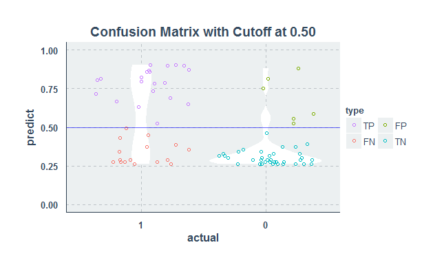
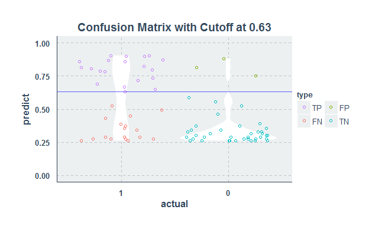

#  System-wide model validation based on sewage levels  

## 

**BACKGROUND**

-   For the QA of the updated model, modeled sewage levels near regulators were evaluated against monitored levels via the `RCalibration` tool

    +   425 level measurements at SWO, trunk, and interceptor
    
    +   the year of 2016

-   The output for each measurement includes 87 plots and 20+ statistics; It's not feasible to evaluate all measurements manually

**OBJECTIVES**

Explore a programmatic way of evaluating the model quality, and rank the measurements so that the most biased sites can be prioritzed for model refinement.

<div class="notes">

For the QA of the updated model, modeled sewage levels near regulators were evaluated against monitored levels via the RCalibration tool, which is a R script that characterize the deviation between observation and modeled data. 425 level measurements at SWO, trunk, and interceptor across the drainage system were included, and the analyzed period is the year of 2016. 

Since the Rcalibration output includes 87 plots and 20+ statistics for each measurement, it's not feasible to evaluate all measurements manually. Therefore, the idea is to explore a programmatic way of evaluating the model quality by utilzing machine learning concepts, and rank the measurements so that the most biased sites can be prioritzed for model refinement.

</div>

##

**METHODOLOGY**

-   The [May 06, 2016](May06rainfall.PNG) event time-series plot was visually evaluated and graded as either fail or pass; The grades were used as the outcome of the logistic regression model

-   examine the statistics (predictors), remove any highly correlated one

-   build logistic regression models with different predictors, select the predictor combinations that best fits the data

-   split the dataset into a training set (80%) and a testing set (20%), calculate the cut-off value to maximize the outcome accuracy
    
-   rank the measurements by the model, weighted by the annual overflow volume

<div class="notes">

</div>

##

**RCalibration Statistics**

**NSE**: Nash-Sutcliffe efficiency, used to assess the predictive power of hydrological models

-   NSE=1:  perfect match
-   NSE=0:  model predictions are as accurate as the mean of the observed data
-   NSE<0:  observed mean is a better predictor than the model
    
**NRMSE**: Normalized root-mean-square deviation (error), characterize the deviation of model to an ideal fit

**Rsq**: coefficient of determination

-   inversely correlated to NRMSE

## IMPLEMENTATION

**Select predictors:**

-   p(NSE>0): percentage of NSE>0 events
-   NRMSE_45line_volume: NRMSE of the event-based integral levels
-   NRMSE_45line.1_peaklevel : NRMSE of the event-based peak levels
    +   removed due to detected correlation with the other predictors

```{r eval=F, echo=T}
caret::findCorrelation(cor(data), cutoff=0.75, names=T)
```

**logistic regression:**

-   start from the simplest model, try multiple predictor combinations, select the model with the smallest AIC number

```{r eval=F, echo=T}
stats::glm(valid_status~`p(NSE>0)`, family = binomial(logit), data=data)
```

***
**Unbalanced logistic regression:**

-   separate the dataset to training set (80%) and testing set (20%)

-   utilize external code for the cut-off value calculation

-   The penalty/cost of FP (failed to detect a bad site) is set to be twice as the FN (failed to detect a good site)

<div class="columns-2">

</img>
<br>
<br>
</img>

</div>
